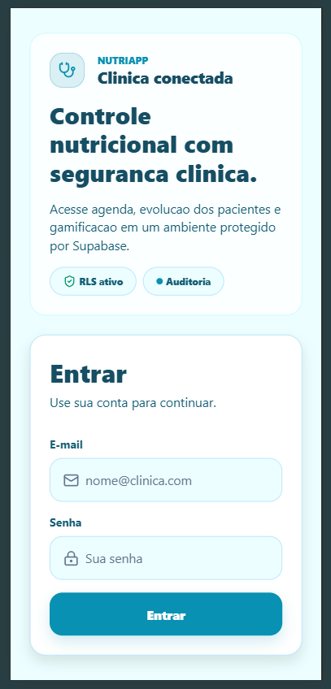

# NutriApp

Plataforma de saúde e nutrição com gamificação, monitoramento clínico em tempo real e controle de consultas. Desenvolvida com React Native (Expo SDK 54) e Supabase como backend.

---

## Integrantes

| Nome | RM |
|------|----|
| Gustavo Bezerra Assumção | RM 553076 |
| Jó Sales | RM 552679 |
| Miguel Garcez de Carvalho | RM 553768 |
| Vinicius Souza e Silva | RM 552781 |

**Turma:** 3ESPR · FIAP · Sprint 3 · 2026

---
### Video de demonstração

https://youtu.be/NwxQx9X8AxA?si=VyvlnHA5xhtWSzjB
 
---

## Instalação

```bash
npm install
```

---

## Execução

```bash
npm start
```

O Expo Developer Tools abre no terminal. Em seguida:

| Plataforma | Ação |
|------------|------|
| Android (emulador ou dispositivo) | Pressione `a` |
| iOS (simulador — requer macOS) | Pressione `i` |
| Navegador (web) | Pressione `w` |
| Expo Go (dispositivo físico) | Escaneie o QR code |

Scripts alternativos:

```bash
npm run android   # Android direto
npm run ios       # iOS direto (macOS)
npm run web       # Navegador
```

---

## Pré-requisitos

- [Node.js](https://nodejs.org/) 18 ou superior
- [npm](https://www.npmjs.com/) 9 ou superior
- [Expo Go](https://expo.dev/go) no celular (para testar em dispositivo físico)

---

## Variáveis de Ambiente

```bash
cp .env.example .env
```

```env
EXPO_PUBLIC_SUPABASE_URL=https://seu-projeto.supabase.co
EXPO_PUBLIC_SUPABASE_ANON_KEY=sua-anon-key
```

> Credenciais disponíveis no painel do Supabase em **Project Settings → API**.

---

## Executar Testes

```bash
npx jest
```

---

## Visão Geral

O NutriApp conecta três perfis em uma única plataforma clínica multitenant:

| Perfil | Responsabilidade |
|--------|-----------------|
| **Administrador** | Gerencia a clínica, aprova nutricionistas, acessa auditoria completa |
| **Nutricionista** | Acompanha pacientes, cria planos alimentares, monitora engajamento |
| **Paciente** | Registra refeições e água, acompanha evolução, compete no ranking |

Cada perfil acessa um conjunto exclusivo de telas, definido por RBAC em duas camadas: navegação frontend e Row Level Security no banco de dados.

---

## Funcionalidades

### Autenticação

**Tela:** `LoginScreen` · **Hook:** `useAuth`

O login é feito com e-mail e senha via Supabase Auth. Ao entrar, o hook `useAuth` busca o perfil do usuário na tabela `profiles` (incluindo o vínculo com a clínica), armazena o ID no interceptor HTTP e redireciona automaticamente para as telas corretas com base no `role` — tudo via `AuthGate` no layout raiz.

A sessão JWT é persistida pelo cliente Supabase em AsyncStorage, então o usuário continua autenticado mesmo após fechar o app. Um listener `onAuthStateChange` revalida a sessão ao reabrir. O último e-mail utilizado é salvo em `nutriapp_preferences` via `useAppPreferences` e pré-preenchido automaticamente no próximo acesso.

Validações da tela:
- E-mail e senha obrigatórios antes de submeter
- Botão desabilitado durante o request (evita cliques duplos)
- Mensagem de erro clara em caso de credenciais inválidas

---

### Perfil do Usuário

**Tela:** `ProfileScreen` · **Hook:** `useProfileUpdate`

Tela unificada para todos os roles. Exibe avatar com iniciais, badge colorido do role, dados de acesso (e-mail, CRM/CRN para nutricionistas) e seção de identificação pessoal editável (nome, CPF, telefone).

Comportamentos notáveis:
- CPF é bloqueado para edição assim que definido (nunca pode ser alterado)
- CRM/CRN é sempre somente leitura (dado pelo admin ao convidar)
- Nutricionistas têm o CRM/CRN buscado dinamicamente de `nutritionist_details`
- Pacientes visualizam pontos de gamificação no card de status; outros roles veem o nome da clínica
- Máscara de CPF (000.000.000-00) e telefone ((00) 00000-0000) aplicadas em tempo real

---

### Home do Paciente

**Tela:** `HomeScreen (patient)` · **Hooks:** `useTodayLogs`, `useGamification`

Painel diário com quatro métricas em tempo real:

| Métrica | Fonte |
|---------|-------|
| Calorias consumidas | Soma de `meal_logs` do dia (categoria MEAL) |
| Litros de água | Soma de `meal_logs` do dia (categoria WATER, unidade MILLILITERS) |
| Pontos do dia | `gamification_stats.points` |
| Streak atual | `gamification_stats.streak_days` |

A barra de progresso calórico é calculada contra a meta diária do plano. Animações nativas via Reanimated (escala nos botões de ação). Dados atualizados em tempo real por subscription Supabase Realtime na tabela `meal_logs`.

---

### Registro de Refeições

**Hook:** `useLogMeal` · integrado na tela de Nutrição

Dois fluxos distintos de registro:

**1. Registro de item do plano** (`log_meal_from_plan`): o paciente confirma ou ajusta quantidade/unidade/calorias de um item prescrito pelo nutricionista. Retorna `xp_earned` e `adherence_pct` (percentual de adesão ao plano).

**2. Registro livre** (`log_free_meal`): o paciente registra uma refeição fora do plano, informando nome, quantidade, unidade e calorias estimadas.

Ambos os fluxos são chamadas RPC no Supabase e retornam `log_id` + XP ganho. O estado `isLogging` desabilita o botão durante o request.

---

### Registro de Água

**Hook:** `useLogWater`

Chama a RPC `log_water_intake(p_amount_ml)` e retorna `log_id`, `xp_earned` e `total_ml` acumulado no dia. A barra de progresso na Home é atualizada instantaneamente via Realtime.

---

### Acompanhamento de Progresso

**Hook:** `useProgressMetrics`

Carrega os últimos 7 dias de `meal_logs` e agrega por data:

- Calorias totais consumidas (categoria MEAL)
- Mililitros de água ingeridos (categoria WATER + unidade MILLILITERS)
- Quantidade de refeições registradas
- Quantidade de exercícios registrados

Os dados alimentam gráficos de evolução semanal. Subscription Realtime mantém os gráficos sincronizados sem necessidade de pull-to-refresh manual.

---

### Plano Nutricional

**Tela:** `MealPlanEditorScreen` (nutricionista) / `PlanDetailScreen` (paciente) · **Hooks:** `useMealPlan`, `usePlanDetail`, `usePlanPermissions`

O módulo de plano nutricional tem comportamento diferente por role:

**Nutricionista (edição completa):**
- Criar plano com título, data de início, data de fim e observações
- Adicionar, editar e excluir itens por refeição (café da manhã, lanche da manhã, almoço, lanche da tarde, jantar, ceia, pré-treino)
- Cada item tem: nome do alimento, quantidade prescrita, unidade e calorias
- Badge de adesão por item: verde (≥80%), amarelo (≥50%), vermelho (<50%)
- Confirmação Alert antes de excluir itens

**Paciente (visualização + registro):**
- Visualiza os itens prescritos agrupados por refeição
- Registra consumo real (pode ajustar quantidade)
- Acompanha calorias consumidas vs. meta do plano

Os dados são gerenciados pela RPC `get_patient_plan_summary` e funções auxiliares `create_meal_plan`, `upsert_meal_plan_item`, `delete_meal_plan_item`.

---

### Lista de Pacientes (Nutricionista)

**Tela:** `NutritionistPatientsScreen` · **Hook:** `useClinicPatients`

FlatList de pacientes vinculados à clínica, cada linha exibindo:
- Nome do paciente
- Streak de dias consecutivos (ícone de chama)
- Pontos totais
- XP acumulado
- Nível (badge colorido: roxo ≥10, azul ≥5, verde abaixo)

O hook calcula automaticamente `lowEngagement`: pacientes com streak ≤ 2 dias ou pontos < 100. Um badge de alerta no topo da tela exibe a contagem. FAB no canto inferior permite convidar novos pacientes por e-mail com validação de nome + e-mail antes de enviar.

Dados sincronizados via Realtime observando `profiles` (role PATIENT) e `gamification_stats`.

---

### Ranking Gamificado

**Tela:** `RankingScreen` · **Hook:** `useGamificationRanking`

Exibe top 10 pacientes da clínica com layout em três camadas:

- **Pódio (1º-3º):** blocos de altura proporcional à posição, medalhas emoji, avatar com iniciais, nível e XP
- **Destaques (4º-5º):** cards horizontais com todos os indicadores
- **Lista (6º-10º):** linhas compactas com posição, nome, nível, pontos e streak

Dados carregados via RPC `get_gamification_ranking(limit)`. Subscription em `gamification_stats` atualiza o ranking em tempo real quando qualquer paciente ganha XP.

---

### Dashboard do Administrador

**Tela:** `DashboardScreen` · **Hook:** `useDashboardStats`

Quatro contadores carregados em paralelo via `Promise.all`:

| Contador | Consulta |
|----------|----------|
| Total de pacientes | `profiles` WHERE role = PATIENT AND clinic_id |
| Total de nutricionistas | `profiles` WHERE role = NUTRITIONIST AND clinic_id |
| Consultas hoje | `appointments` WHERE data = hoje AND status ≠ CANCELLED |
| Nutricionistas pendentes | `nutritionist_details` WHERE status = PENDING |

Subscription Realtime em `profiles`, `appointments` e `nutritionist_details` mantém os números atualizados. Seções adicionais: consultas acontecendo agora, próxima consulta, ações rápidas (contextuais por role) e card de aprovações pendentes.

---

### Gerenciamento de Nutricionistas (Admin)

**Tela:** `AdminNutritionistsScreen` · **Hook:** `useNutritionists`

Lista todos os nutricionistas da clínica com status de aprovação (APPROVED, PENDING, REJECTED) e CRM/CRN. FAB para convidar novo nutricionista por e-mail, exigindo nome + e-mail + CRM/CRN.

O hook observa mudanças em `profiles` e `nutritionist_details` simultaneamente via dois canais Realtime, garantindo que aprovações refletem imediatamente na lista.

---

### Logs de Auditoria

**Tela:** `AuditLogsScreen` · **Hook:** `useAuditLogs`

Acesso exclusivo do ADMIN. Lista os últimos 50 registros da tabela `audit.unified_logs` (schema separado do `public`), cada entrada contendo:

- Timestamp formatado (data e hora)
- Tabela afetada (`table_name`)
- Operação: INSERT (verde), UPDATE (azul), DELETE (vermelho)
- Role do executor (`actor_role`)

Toque em qualquer entrada abre modal com JSON formatado dos dados `old_data` e `new_data`. Subscription INSERT em `unified_logs` adiciona novos eventos sem necessidade de refresh. Pull-to-refresh disponível.

---

### Configurações da Clínica

**Tela:** `ClinicSettingsScreen` · **Hook:** `useClinicManagement`

Permite ao ADMIN editar nome e telefone da clínica com máscara de telefone em tempo real. Link direto para logs de auditoria. Seção de localização reservada para implementação futura (renderizada desabilitada). Validação obrigatória de nome antes de salvar.

---

### Agenda

**Tela:** `ScheduleScreen` · **Hook:** `useAppointments`

Três modos de visualização (ADMIN e NUTRITIONIST têm acesso a todos; PATIENT somente mensal):

| Modo | Layout |
|------|--------|
| **Diário** | Timeline de 7h às 20h com slots por hora. "Livre" quando sem consulta |
| **Semanal** | Grid de 7 dias com cards de consultas empilhados por dia |
| **Mensal** | Calendário completo com dots indicando dias com consultas |

Navegação por período com `movePeriod(+1/-1)`. Dia atual destacado. `AppointmentCard` exibe paciente/nutricionista, horário, duração e status com cor.

---

### Gamificação (transversal)

**Hook:** `useGamification` (shared)

Sistema integrado a múltiplas telas:

| Componente | Onde aparece |
|-----------|-------------|
| `LevelCard` | Home do paciente, Perfil |
| `StreakBadge` | Lista de pacientes, Ranking |
| `XPProgressBar` | Home do paciente |

O hook carrega `points`, `level`, `experience`, `streak_days` de `gamification_stats` e calcula `nextLevelExperience` pela fórmula de progressão de nível. Subscription Realtime atualiza em tempo real ao registrar refeições ou água.

---

## Arquitetura

O projeto segue **Feature-First + Domain-Driven Design (DDD)**.

```
Expo Router (File-based routing)
        │
        ├── AuthGate (redireciona por role ao iniciar)
        │
        ├── (auth)/login         → LoginScreen
        └── (tabs)/              → Tab bar dinâmica por role (RBAC)
              ├── PATIENT       → Home, Nutrição, Progresso, Agenda, Perfil
              ├── NUTRITIONIST  → Home, Pacientes, Ranking, Nutrição, Perfil
              └── ADMIN         → Dashboard, Nutricionistas, Auditoria, Clínica, Perfil
```

### Fluxo de Dados

```
Supabase Auth
      │
      ▼
useAuth (hook) ──► AuthContext ──► Screens
      │
      ▼
Supabase DB (PostgreSQL + RLS)
      │
      ▼
Feature Hooks ──► Components ──► UI
      │
      ▼
Supabase Realtime (subscriptions em tempo real)
```

---

## Estrutura de Pastas

```
.
├── assets/
│   ├── fonts/                    # Fontes customizadas
│   └── images/                   # Ícones e splash screen
│
├── src/
│   ├── app/                      # Expo Router — rotas (páginas)
│   │   ├── _layout.tsx           # Root layout + AuthGate
│   │   ├── (auth)/               # Rotas de autenticação
│   │   │   └── login.tsx
│   │   ├── (tabs)/               # Navegação principal (tab bar)
│   │   │   ├── _layout.tsx       # Layout com tabs por role
│   │   │   ├── home.tsx
│   │   │   ├── nutrition.tsx
│   │   │   ├── progress.tsx
│   │   │   ├── schedule.tsx
│   │   │   ├── profile.tsx
│   │   │   ├── patients.tsx
│   │   │   ├── ranking.tsx
│   │   │   ├── nutritionists.tsx
│   │   │   ├── clinic-audit.tsx
│   │   │   └── clinic-settings.tsx
│   │   ├── accept-invite.tsx     # Aceite de convite por link
│   │   ├── meal-plan.tsx         # Editor de plano alimentar
│   │   ├── nutritionist-patients.tsx
│   │   └── patient-progress.tsx
│   │
│   ├── features/                 # Módulos de domínio
│   │   ├── auth/
│   │   │   ├── context/          # AuthContext (Provider global)
│   │   │   ├── domain/           # Tipos: User, AuthState, UserRole
│   │   │   ├── hooks/            # useAuth, useProfileUpdate
│   │   │   └── screens/          # LoginScreen, ProfileScreen, AcceptInviteScreen
│   │   │
│   │   ├── admin/
│   │   │   ├── components/       # DashboardHeader, QuickActionGrid, etc.
│   │   │   ├── domain/           # Tipos admin e dashboard
│   │   │   ├── hooks/            # useDashboardStats, useNutritionists, useAuditLogs
│   │   │   └── screens/          # DashboardScreen, AuditLogsScreen, etc.
│   │   │
│   │   ├── nutritionist/
│   │   │   ├── domain/           # Tipos do nutricionista
│   │   │   ├── hooks/            # useClinicPatients, useGamificationRanking, useMealPlan
│   │   │   └── screens/          # PatientsScreen, RankingScreen, MealPlanEditorScreen
│   │   │
│   │   ├── patient/
│   │   │   ├── domain/           # Tipos do paciente
│   │   │   ├── hooks/            # useProgressMetrics, useTodayLogs, useLogMeal, useLogWater
│   │   │   └── screens/          # HomeScreen, NutritionScreen, ProgressScreen
│   │   │
│   │   ├── calendar/
│   │   │   ├── domain/           # Appointment, Meal, MealPlan
│   │   │   ├── hooks/            # useAppointments
│   │   │   └── screens/          # ScheduleScreen
│   │   │
│   │   └── nutrition/            # Módulo compartilhado de plano nutricional
│   │       ├── components/       # MealSection, LogItemModal, UpsertItemModal, etc.
│   │       ├── context/          # PlanDetailContext
│   │       ├── hooks/            # usePlanDetail, usePlanPermissions
│   │       ├── screens/          # PlanDetailScreen
│   │       └── types.ts          # Tipos do domínio nutricional
│   │
│   └── shared/                   # Infraestrutura e componentes globais
│       ├── components/
│       │   ├── gamification/     # LevelCard, StreakBadge, XPProgressBar
│       │   ├── ui/               # StatCard, PatientCard, AppointmentCard, InlineStatus
│       │   └── PersistentTabBar.tsx
│       ├── domain/
│       │   └── gamification.ts   # GamificationState, Badge, tipos de XP
│       ├── hooks/
│       │   ├── useGamification.ts
│       │   ├── useInviteUser.ts
│       │   └── useAppPreferences.ts  # AsyncStorage para preferências do usuário
│       ├── infrastructure/
│       │   └── supabase/
│       │       ├── client.ts          # Supabase client (AsyncStorage + interceptor)
│       │       ├── database.types.ts  # Tipos gerados do schema PostgreSQL
│       │       └── interceptor.ts     # Injeta X-User-Id nos headers de cada requisição
│       ├── navigation/
│       │   └── tabs.ts           # Mapeamento role → tabs (RBAC)
│       ├── theme/
│       │   ├── tokens.ts         # colors, spacing, radius, fontSize, shadow, timing
│       │   ├── appStyles.ts      # StyleSheet global reutilizável
│       │   └── index.ts
│       └── utils/
│           ├── date.ts           # Formatação de datas
│           ├── format.ts         # Formatação de valores numéricos
│           └── realtime.ts       # Nomes únicos de canal Supabase Realtime
│
├── supabase/
│   └── migrations/               # 31 arquivos SQL (schema + RLS + triggers)
│
├── .env.example                  # Template de variáveis de ambiente
├── app.json                      # Configuração Expo
├── package.json
└── tsconfig.json                 # TypeScript strict mode
```

---

## Controle de Acesso (RBAC)

### Camada 1 — Navegação (Frontend)

| Role | Abas disponíveis |
|------|-----------------|
| `PATIENT` | Home, Nutrição, Progresso, Agenda, Perfil |
| `NUTRITIONIST` | Home, Pacientes, Ranking, Nutrição, Perfil |
| `ADMIN` | Dashboard, Nutricionistas, Auditoria, Clínica, Perfil |

### Camada 2 — Banco de Dados (Row Level Security)

| Tabela | Admin | Nutricionista | Paciente |
|--------|-------|---------------|---------|
| `profiles` | Leitura da clínica | Leitura dos pacientes | Apenas próprio perfil |
| `meal_plans` | — | CRUD completo | Leitura |
| `meal_logs` | — | Leitura | CRUD próprio |
| `appointments` | — | CRUD | Leitura |
| `gamification_stats` | Leitura | Leitura | Leitura próprio |
| `audit.unified_logs` | Leitura total | — | — |
| `clinics` | CRUD | Leitura | — |
| `nutritionist_details` | CRUD | Próprio | — |

> Admin **não acessa** dados clínicos sensíveis dos pacientes por política RLS.

---

## Persistência Local (AsyncStorage)

| Chave | Conteúdo | Quando atualizado |
|-------|----------|------------------|
| `supabase.auth.token` | Sessão JWT completa (gerenciado pelo Supabase client) | Login / refresh automático |
| `nutriapp_user_id` | ID do usuário autenticado | Login / logout |
| `nutriapp_preferences` | `{ lastEmail, notificationsEnabled }` | Login bem-sucedido |

Os dados persistem após o fechamento do app e são restaurados automaticamente na próxima abertura.

---

## Tecnologias Utilizadas

| Tecnologia | Versão | Uso |
|-----------|--------|-----|
| [Expo](https://expo.dev/) | 54.0.33 | Framework React Native |
| [React Native](https://reactnative.dev/) | 0.81.5 | Interface nativa iOS/Android |
| [TypeScript](https://www.typescriptlang.org/) | 5.9.2 | Tipagem estática (strict mode, zero `any`) |
| [Expo Router](https://expo.github.io/router/) | 6.0.23 | Navegação file-based com rotas tipadas |
| [Supabase JS](https://supabase.com/) | 2.105.3 | Auth, Database, Realtime, Edge Functions |
| [AsyncStorage](https://react-native-async-storage.github.io/async-storage/) | 2.2.0 | Persistência local de sessão e preferências |
| [React Native Reanimated](https://docs.swmansion.com/react-native-reanimated/) | 4.1.1 | Animações nativas |
| [Lucide React Native](https://lucide.dev/) | 1.14.0 | Biblioteca de ícones |
| [React Native Safe Area Context](https://github.com/th3rdwave/react-native-safe-area-context) | 5.6.0 | Safe areas iOS/Android |
| [Jest](https://jestjs.io/) | 30.x | Testes unitários |

---

## Screenshots

### Autenticação

| Login | E-mail de Convite | Criação de Senha |
|:-----:|:-----------------:|:----------------:|
|  |  |  |

### Paciente

| Home | Alimentação | Registro de Refeição |
|:----:|:-----------:|:--------------------:|
|  |  |  |

| Evolução (Gráficos) | Evolução (Detalhes) | Perfil |
|:-------------------:|:-------------------:|:------:|
|  |  |  |

### Nutricionista

| Pacientes | Detalhe do Paciente | Convidar Paciente |
|:---------:|:-------------------:|:-----------------:|
|  |  |  |

| E-mail de Convite | Ranking | Agenda |
|:-----------------:|:-------:|:------:|
|  |  |  |

| Plano Alimentar | Editar Item | Remover Item |
|:---------------:|:-----------:|:------------:|
|  |  |  |

| Progresso do Paciente | Perfil |
|:---------------------:|:------:|
|  |  |

### Administrador

| Nutricionistas | Clínica | Perfil |
|:--------------:|:-------:|:------:|
|  |  |  |

---

## Banco de Dados

O schema completo está em `supabase/migrations/` (31 arquivos SQL). Principais tabelas:

| Tabela | Descrição |
|--------|-----------|
| `clinics` | Clínicas cadastradas |
| `profiles` | Usuários (Admin, Nutricionista, Paciente) |
| `nutritionist_details` | CRM/CRN e status de aprovação |
| `appointments` | Consultas agendadas |
| `meal_plans` / `meal_plan_items` | Planos alimentares e seus itens |
| `meal_logs` | Registros de refeições dos pacientes |
| `water_logs` | Registro de consumo de água |
| `gamification_stats` | Pontos, XP, level e streak |
| `badges` / `patient_badges` | Conquistas desbloqueadas |
| `audit.unified_logs` | Auditoria de todas as operações do sistema |

---

## Licença

Projeto acadêmico — FIAP · 3ESPR · Sprint 3 · 2026.
