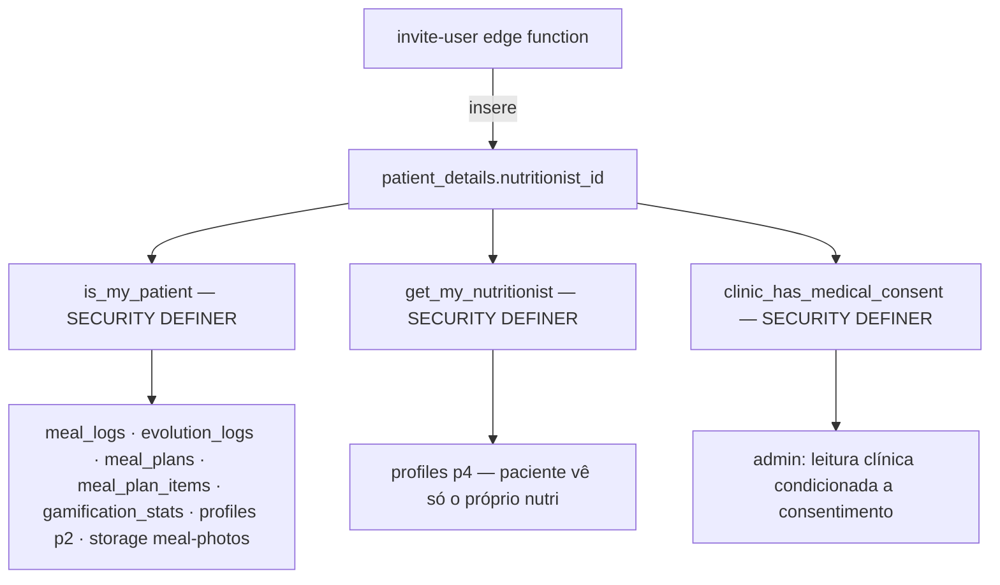

# RBAC — Isolamento por Nutricionista (Carteira de Pacientes)

**Migration:** `supabase/migrations/20260611150000_rbac_per_nutritionist_isolation.sql`
**Data:** 2026-06-11

## Requisitos atendidos

| Requisito | Implementação |
|-----------|---------------|
| Admin vê pacientes, mas não dados privados | `profiles` p3 (leitura da clínica) mantida; `meal_logs`/`evolution_logs`/`meal_plans` sem policy de admin (exceto consentimento) |
| Admin vê nutricionistas e os pacientes de cada um | `profiles` p3 + `gamification_stats` policy `admins_view_clinic_stats` (alimenta `useNutritionistPatients`, que filtra por `nutritionist_id`) |
| Nutricionista SÓ vê os próprios pacientes | Todas as policies clínicas condicionadas a `is_my_patient(patient_id)` (vínculo `patient_details.nutritionist_id`) |
| Paciente vê SOMENTE o próprio nutricionista | `profiles` p4 reescrita: `id = get_my_nutritionist()` |
| Nutricionista tem N pacientes | Relação 1:N já existente — `patient_details.nutritionist_id` (FK), populada pela edge function `invite-user` (linha 91: quem convida vira o responsável) |
| Clínica vê tudo, menos dados médicos sem permissão do nutricionista | Nova coluna `patient_details.clinic_access_granted` (default `false`) + helper `clinic_has_medical_consent()` nas policies de `meal_logs`/`evolution_logs` |
| Ranking quantifica os dados | RPC `get_gamification_ranking` (`SECURITY DEFINER`, escopo por clínica) intacta — não depende das policies de tabela |

## Arquitetura

Helpers são `SECURITY DEFINER` com `search_path = public` fixo — evitam recursão de RLS (policy de `meal_logs` consultando `patient_details`, que tem RLS própria) e seguem o padrão já usado por `get_user_role()`/`get_user_clinic()`.

## Policies alteradas

| Tabela | Removida (clinic-wide) | Nova (per-nutritionist) |
|--------|------------------------|--------------------------|
| `meal_logs` | `Nutritionists view clinic logs` (incluía ADMIN) | `nutritionists_view_own_patient_logs` + `admins_view_logs_with_consent` |
| `evolution_logs` | `Nutritionists manage clinic evolution` (incluía ADMIN) | `nutritionists_manage_own_patient_evolution` + `admins_view_evolution_with_consent` |
| `meal_plans` | `meal_plans: nutritionist full` (incluía ADMIN) | `meal_plans: nutritionist own patients` |
| `meal_plan_items` | `meal_plan_items: nutritionist full` (incluía ADMIN) | `meal_plan_items: nutritionist own patients` |
| `profiles` | `p2_nutritionists_view_clinic`, `p4_patients_view_nutritionists` | `p2_nutritionists_view_own_patients`, `p4_patients_view_own_nutritionist` |
| `gamification_stats` | `Authenticated users view clinic stats` (qualquer membro via clínica) | `patients_view_own_stats` + `nutritionists_view_own_patient_stats` + `admins_view_clinic_stats` |
| `appointments` | `Nutritionists manage clinic appointments` (qualquer nutri/admin da clínica) | `nutritionists_manage_own_appointments` + `admins_view_clinic_appointments` |
| `storage.objects` (meal-photos) | `nutritionist_select_patient_meal_photos` — **quebrada** (JOIN em `clinic_members`, tabela inexistente) | `nutritionist_select_own_patient_meal_photos` via `patient_details` |

## Impacto no frontend (zero mudança de código)

RLS estreita os resultados; queries existentes continuam válidas:

| Hook/Tela | Antes | Depois |
|-----------|-------|--------|
| `useClinicPatients` (nutri) | Todos pacientes da clínica | Só os próprios (RLS em `profiles`) |
| `useGamificationRanking` | Ranking da clínica | Inalterado (RPC DEFINER) |
| `useNutritionistPatients` (admin) | Funciona | Inalterado (`admins_view_clinic_stats`) |
| `useDashboardStats` (admin) | profiles/appointments/nutritionist_details | Inalterado (policies de admin cobrem) |
| Fotos no detalhe do paciente (nutri) | **Quebrado** (policy inválida no banco) | Funciona, restrito aos próprios pacientes |

## Verificação RLS (roteiro manual)

1. Nutricionista A loga → tela Pacientes lista apenas pacientes convidados por A.
2. Nutricionista B (mesma clínica) loga → não vê pacientes de A (lista, detalhe, plano, fotos, logs).
3. Paciente loga → Perfil/Agenda só mostram o nutricionista responsável.
4. Admin loga → Dashboard, lista de nutricionistas e pacientes por nutricionista funcionam; consulta direta a `meal_logs` de qualquer paciente retorna vazio.
5. `UPDATE patient_details SET clinic_access_granted = true WHERE id = '<paciente>'` (como nutricionista responsável) → admin passa a ler `meal_logs` desse paciente.
6. Ranking (nutri e paciente) continua exibindo a clínica inteira.

## Pendência conhecida

- UI para o nutricionista alternar `clinic_access_granted` (hoje: via SQL/Supabase Studio). Mecanismo de banco pronto; toggle no `PatientDetailScreen` é follow-up.
